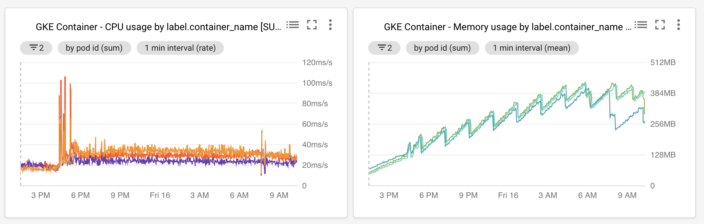
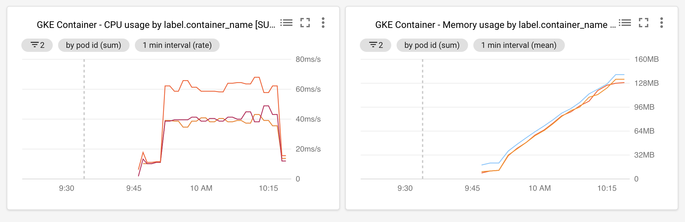

# Etcd Locking Memory Leak

I'm seeing what looks like a memory leak in etcd, when subject to lots
of lock and unlock cycles.

We keep no data in etcd, it is used solely for locking. At any moment,
we might have 5ish locks active.

Auto-compaction is set to 10 minutes.

## Test Setup

Using the coreos etcd-operator, apply
[etcd-cluster.yaml](./etcd-cluster.yaml) to create the cluster.

Then, setup port forwarding.

And finally, run the provided go code.

```shell
$ kubectl apply -f etcd-cluster.yaml
$ kubectl port-forward svc/test-etcd-cluster-client 2379


$ ETCDCTL_API=3  etcdctl member list
8b2f444948ecc60, started, test-etcd-cluster-zc8hwvl7hp, http://test-etcd-cluster-zc8hwvl7hp.test-etcd-cluster.default.svc:2380, http://test-etcd-cluster-zc8hwvl7hp.test-etcd-cluster.default.svc:2379
1f99aa42dd58e078, started, test-etcd-cluster-tb8gsq9hcj, http://test-etcd-cluster-tb8gsq9hcj.test-etcd-cluster.default.svc:2380, http://test-etcd-cluster-tb8gsq9hcj.test-etcd-cluster.default.svc:2379
8e760460d13bc7ca, started, test-etcd-cluster-kp8grrf9ms, http://test-etcd-cluster-kp8grrf9ms.test-etcd-cluster.default.svc:2380, http://test-etcd-cluster-kp8grrf9ms.test-etcd-cluster.default.svc:2379

```

If you watch the locks, you should see a stream go by

```shell
$ ETCDCTL_API=3  etcdctl watch --prefix /

DELETE
/locks/rkotaoepervrdnnkylhzsycdvsfsztsl/pack:_zeipwmpqbbtoknnuivim:szbwcowdnooasapnqmsj/gakexueeikyssjsu-krpbffeigemdacvr/47ca671cfc13cbe5

PUT
/locks/gjsvgjcxdlbnzdwomebgkjzmdnccdckt/pack:_kmclxbittlwczoendtil:gnptoszgxqpshjukzehd/yawculantbifgfue-qkbkhenwtlzdzdto/47ca671cfc13cc0a

```

Memory usage seems to grow without bounds. (Graphs from google stackdriver)

Preoduction graph, since the last cluster re-create


My test case, running about 30 minutes. The logs show 3 auto
compaction cycles:



